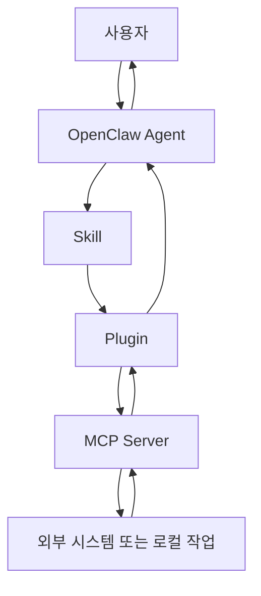
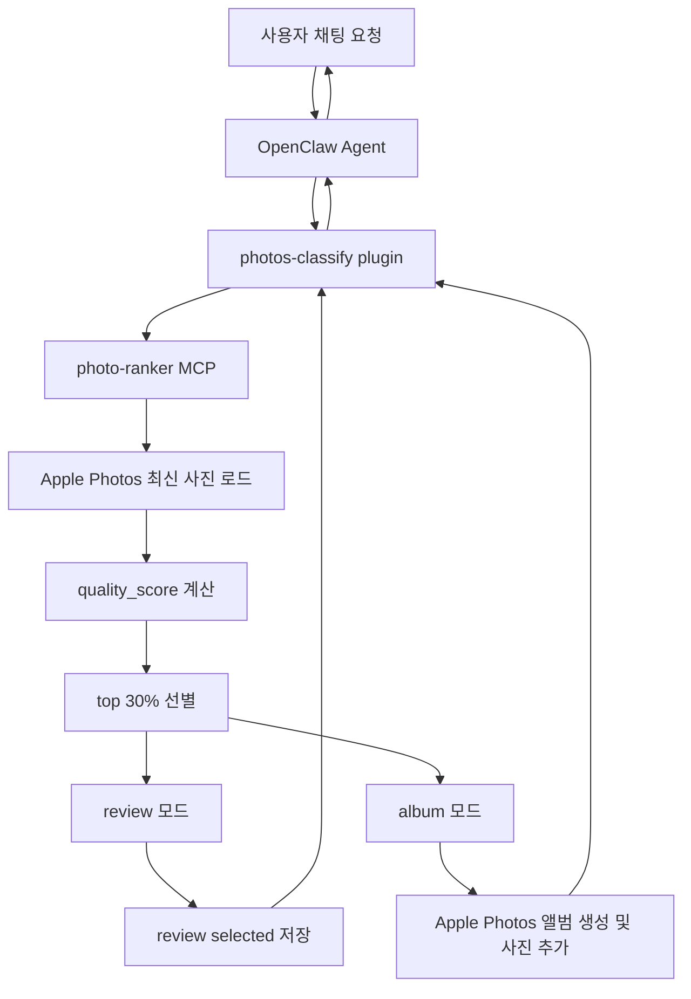

# Photos Classify 용어와 처리 흐름 정리

작성일: 2026-04-02

## 목적

`photos-classify` 작업을 진행하면서 자주 같이 등장하는 아래 용어를 구분한다.

- skill
- plugin
- MCP
- extension

또한 OpenClaw 안에서 실제 사용자 요청이 어떤 경로로 흘러가는지 `photos-classify` 기준으로 정리한다.

## 한 줄 정의

### skill

LLM 또는 에이전트가 어떤 방식으로 문제를 풀지 알려주는 작업 지침이다.

- 실행 엔진이 아니라 작업 방식 설명서에 가깝다.
- 어떤 도구를 먼저 써야 하는지, 어떤 검증을 해야 하는지, 어떤 기준으로 판단해야 하는지를 안내한다.
- 코드 수정 없이도 동작 방식을 바꿀 수 있다.

### plugin

호스트 애플리케이션인 OpenClaw에 기능을 등록하는 확장 단위다.

- 명령 등록
- HTTP route 등록
- 설정 스키마 등록
- 서비스/도구/provider 연결

`photos-classify` 는 OpenClaw가 로드하는 plugin 이다.

### MCP

Model Context Protocol 기반의 도구 서버다.

- 보통 별도 프로세스로 실행된다.
- 실제 기능 실행을 담당한다.
- 사진 조회, 분류, 앨범 생성, 파일 내보내기 같은 무거운 작업을 여기서 수행한다.

`photo-ranker`, `photo-source` 는 MCP 서버다.

### extension

plugin 코드를 담는 패키지 또는 폴더 단위다.

- OpenClaw 저장소/작업 저장소에서는 보통 `extensions/...` 아래에 위치한다.
- packaging 단위로 이해하면 된다.

즉 `extensions/photos-classify/` 는 extension 폴더이고, 그 안에서 로드되는 `photos-classify` 가 plugin 이다.

## 관계 요약

아래처럼 이해하면 된다.

```text
skill = 에이전트 작업 방식 안내
plugin = OpenClaw 안의 기능 입구
MCP = 실제 작업 실행 서버
extension = plugin 코드를 담는 패키지/폴더
```

## Photos Classify 기준 매핑

### skill 예시

- 사진 분류 요청을 받았을 때 어떤 도구를 확인할지
- review write-back 검증을 어떤 순서로 할지
- 런타임 검증을 글로벌 OpenClaw 기준으로 해야 한다는 운영 규칙

### plugin 예시

- [extensions/photos-classify/index.ts](extensions/photos-classify/index.ts)
- `/classify`, `/classify-status`, `/classify-review` 같은 명령 등록
- `/plugins/photos-classify/*` review route 등록

### MCP 예시

- [mcp-servers/photo-ranker/server.py](mcp-servers/photo-ranker/server.py)
- [mcp-servers/photo-source/server.py](mcp-servers/photo-source/server.py)

여기서 실제로 수행하는 작업 예시는 아래와 같다.

- Apple Photos 최신 30장 조회
- `quality_score` 계산
- 상위 30% 선별
- review selected 저장
- Apple Photos 앨범 생성
- Apple Photos 앨범에 사진 추가

### extension 예시

- [extensions/photos-classify](extensions/photos-classify)

이 디렉터리 안에는 plugin manifest, 설정, route, 명령 정의, README 가 함께 들어 있다.

## 전체 처리 흐름

OpenClaw에서 사용자 요청이 처리되는 일반 흐름은 아래와 같다.

```text
사용자 요청
  ↓
OpenClaw agent
  ↓
skill
  어떤 방식으로 처리할지 판단 보조
  ↓
plugin
  OpenClaw 안에서 명령/route/설정 표면 제공
  ↓
MCP
  실제 도구 실행
  ↓
결과 반환
  ↓
plugin
  결과를 정리하고 review URL 또는 응답 텍스트로 연결
  ↓
OpenClaw agent
  ↓
사용자 응답
```

## Photos Classify 요청 흐름

예시 요청:

```text
Apple Photos 최신 30장 중 잘 나온 사진만 골라서 잘나온사진1 앨범에 넣어줘.
```

이 요청이 이상적으로 처리되는 흐름은 아래와 같다.

```text
사용자
  ↓
OpenClaw agent
  요청 해석
  ↓
photos-classify plugin
  사진 분류 관련 기능으로 요청 연결
  ↓
photo-ranker MCP
  최신 30장 로드
  ↓
quality_score 계산
  ↓
상위 30% 선별
  ↓
writeback_mode 선택
  ├─ review: selected=true 로 표시
  └─ album: 대상 앨범 생성 후 사진 추가
  ↓
plugin
  job_id, review URL, 결과 요약 정리
  ↓
사용자 응답
```

## Mermaid 흐름도

### 일반 구조



### Photos Classify 구조



## 코드 기준 대응 위치

실제 코드 위치를 기준으로 보면 아래처럼 연결된다.

```text
사용자 요청
  ↓
[extensions/photos-classify/index.ts](extensions/photos-classify/index.ts)
  plugin 명령/route 등록
  ↓
[mcp-servers/photo-ranker/server.py](mcp-servers/photo-ranker/server.py)
  분류, 선별, write-back 도구 실행
  ↓
[mcp-servers/photo-ranker/album_writer.py](mcp-servers/photo-ranker/album_writer.py)
  Apple Photos 앨범 생성/추가
  ↓
[extensions/photos-classify/src/review-http.ts](extensions/photos-classify/src/review-http.ts)
  review route 제공
```

## 실무적으로 기억할 점

### 1. skill 은 기능이 아니라 작업 규칙이다

skill 이 있다고 기능이 실행되는 것은 아니다. 실제 실행은 plugin 과 MCP 가 담당한다.

### 2. plugin 은 입구이고 MCP 는 실행기다

OpenClaw 안에서 사용자가 보는 명령이나 route 는 plugin 이 제공하지만, 실제 사진 처리 로직은 MCP 가 담당한다.

### 3. extension 과 plugin 은 같은 의미가 아니다

실무에서는 섞어 부르기 쉽지만, extension 은 패키지 단위이고 plugin 은 그 안에서 로드되는 기능 단위다.

### 4. `photos-classify` 개선은 주로 plugin-MCP 경계에서 일어난다

이번 작업처럼 자연어 요청을 실제 작업으로 바꾸려면 보통 아래 둘 중 하나를 수정하게 된다.

- plugin 이 어떤 MCP 도구를 고를지
- MCP 가 어떤 고수준 workflow tool 을 제공할지

즉 대부분의 기능 개선은 skill 이 아니라 plugin 과 MCP 표면을 다듬는 작업이다.